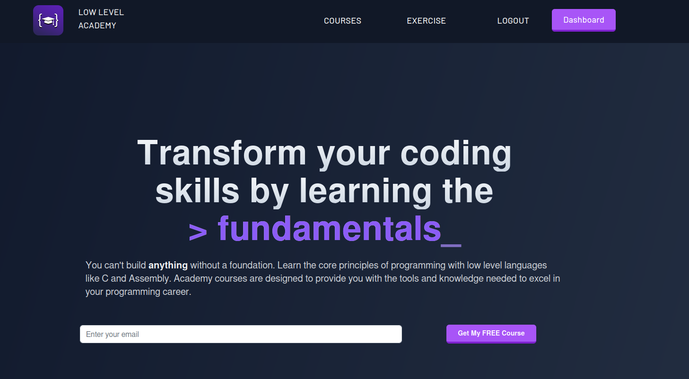

## Starting my journey to learn this horrible language with the help of [lowlevelacademy](https://lowlevel.academy/).

### __Ok but it is a cool course and all in all i would recommend it, lowlevelcoding is great plus he uses ```neovim btw```__

This will be all the coourses into one repo, it would look better having 4 C repos in my github but does it really matter? Just use rust.




# Zero2Hero C Programming

__Basically done, ```-u``` is left to add to the program.__

## TODOS
- [X] add -r flag to remove employees based on name ( maybe remove one unless like -rr flag ? idk )
kinda done i am sure it sucks, i just have to clear the file from the other data
  - [X] truncate the end of the file after writing the data ( ok is this really the way to do this?)
- [ ] add -u flag to update employee hours based on name

# Network Applications in C

NOT YET STARTED - Next in line,speed run soon.

# Multi Threaded C Applications

NOT YET STARTED

# Multi Threaded C Applications

NOT YET STARTED

# Build Your Own HTTP Server

NOT YET STARTED


#### _This is me going off scope but who cares really,make is not the way_ can be for the full project when i a m done with this torture
- [ ] Use zig to build the project, i hate make already, what magic is this.
